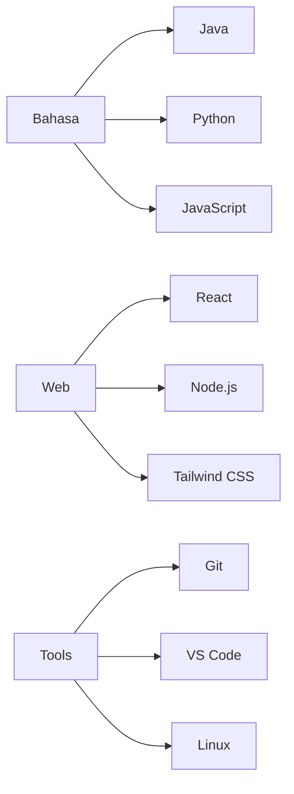

# Risdiyanto (kangrissoft) - Curriculum Vitae

## 👨‍💻 Tentang Saya
Saya seorang pengembang perangkat lunak dengan fokus pada pengembangan web dan aplikasi Android. Dengan latar belakang di berbagai teknologi modern, saya senang membangun solusi yang efisien dan user-friendly.

## 🛠 Tech Stack

### Bahasa Pemrograman

### Pengembangan Web

### Alat & Teknologi

## 📚 Sedang Dipelajari
- 
- 
- Dasar-dasar DevOps (Docker, CI/CD)

## 💼 Layanan Profesional
Saya membuka jasa pengembangan untuk:
- Website dan Aplikasi Web
- Aplikasi Android
- Solusi Otomasi
- Konsultasi Teknologi

## 📫 Kontak
- GitHub: [kangrissoft](https://github.com/kangrissoft)
- Email: risdiyanto@example.com
- Portfolio: [https://kangrissoft-portfolio.vercel.app](https://kangrissoft-portfolio.vercel.app) *(contoh link)*

---

⭐ Repository ini dibuat dengan ❤️ menggunakan [Next.js](https://nextjs.org/) dan [Tailwind CSS](https://tailwindcss.com/)
